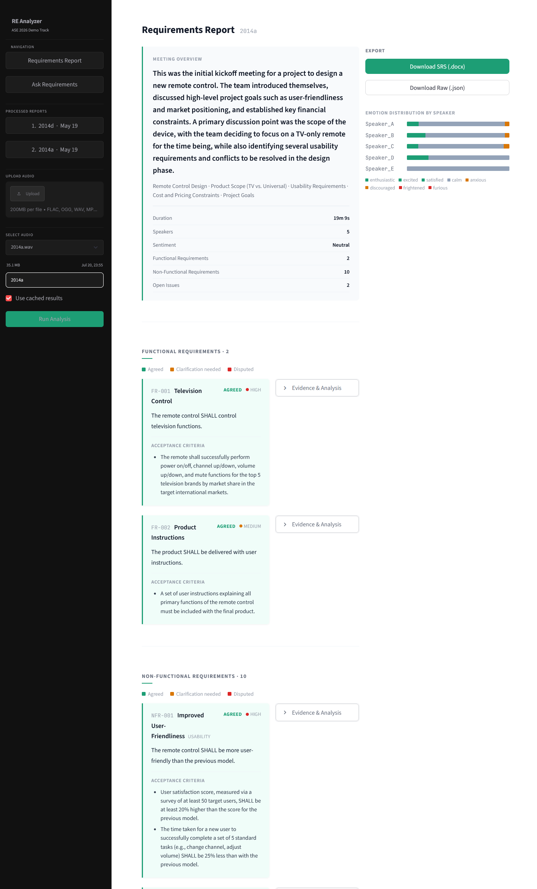
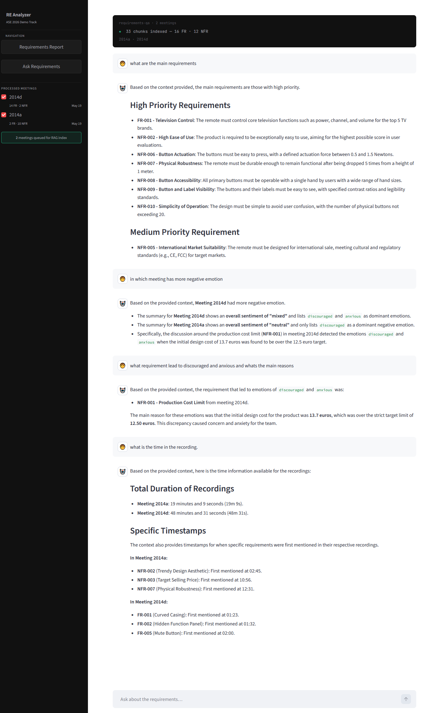

# EmoRE

**An Emotion-Aware Tool for Automated Requirements Elicitation from Meeting Recordings**

EmoRE takes raw meeting audio and produces IEEE 29148-compliant Software Requirements
Specifications (SRS) enriched with per-utterance emotion annotations — no manual
transcription step. A retrieval-augmented generation (RAG) module answers natural-language
questions spanning multiple meetings, supporting cross-sprint requirement traceability.

> Submitted to the **34th IEEE International Requirements Engineering Conference (RE'26)**,
> Posters and Tool Demos Track.

---

## Screenshots

| Requirements Report | Ask Requirements (RAG QA) |
|---|---|
|  |  |

---

## Pipeline

```
meeting audio (.wav/.mp3/.m4a/.flac/.ogg)
        │
        ▼
Stage 1 — Audio Analysis            [Gemini 2.5 Pro, multimodal]
  speaker diarization · verbatim transcript · MM:SS timestamps
  8-class emotion label per utterance · confidence score
        │
        ▼
Stage 2 — SRS Generation            [Gemini 2.5 Pro, IEEE 29148 prompt]
  Functional Requirements · Non-Functional Requirements · Open Issues
  priority · acceptance criteria · conflict level · evidence · stakeholders
        │
        ▼
Streamlit UI  ──►  .docx / .json export
        │
        └──►  RAG QA over one or more processed meetings
```

**Emotion classes:** `anxious` · `calm` · `discouraged` · `enthusiastic` ·
`excited` · `frightened` · `furious` · `satisfied`

Emotion signals are mapped to requirement attributes explicitly: `furious` forces
`conflict_level=high` and generates an open issue; `anxious`/`frightened` without a
resolution signal sets `unresolved=true`; `enthusiastic`/`excited` raises priority.

---

## Setup

```bash
git clone <this-repo>
cd REDocDemo2026
pip install -r requirements.txt
```

Create your `.env` from the template and add a
[Gemini API key](https://aistudio.google.com/apikey):

```bash
cp .env.example .env
# then edit .env and set GEMINI_API_KEY=...
```

Run the app:

```bash
streamlit run app.py
```

---

## Usage

1. Put an audio file in `data/audio/`, or drag one into the sidebar uploader.
2. Select it, set a **Meeting ID**, click **Run Analysis**.
   WAV files longer than 30 minutes are split into chunks automatically, with
   timestamps offset and merged back into a single utterance stream.
3. Inspect the generated report; export as `.docx` (IEEE 29148 layout) or raw `.json`.
4. Switch to **Ask Requirements**, tick one or more processed meetings in the sidebar
   to build the RAG index, then ask questions in natural language.

Results are cached in `data/outputs/` as `<MeetingID>_step1.json` and
`<MeetingID>_processed.json`. Re-running with **Use cached results** checked skips
the API calls.

---

## Project layout

| File | Purpose |
|---|---|
| `app.py` | Streamlit frontend + full pipeline orchestration |
| `step1_audio_analysis.py` | Stage 1 prompt (audio → transcript + emotion) |
| `generate_srs.py` | Stage 2 prompt (transcript → IEEE 29148 SRS) + timestamp attachment |
| `ask_requirements.py` | RAG module: chunking, embeddings, cosine retrieval, answer generation |
| `test_gemini.py` | Standalone CLI experiment (voice-print speaker re-ID; optional deps) |
| `paper.md` | RE'26 demo paper draft |

**Models:** `gemini-2.5-pro` for analysis and generation, `gemini-embedding-001`
(3072-dim, v1beta API) for retrieval.

---

## Dataset

Evaluated on four consecutive scenario meetings (**ES2014a–d**) from the
[AMI Meeting Corpus](https://groups.inf.ed.ac.uk/ami/corpus/).
Audio files are **not** included in this repository — download them from the AMI
site and place them in `data/audio/`. Sample processed outputs are included in
`data/outputs/` so the report and QA pages can be explored without an API key.

---

## Notes

- `.env` is gitignored. Never commit your API key.
- Processing cost scales with audio length; the Gemini free tier is sufficient for
  short demo clips.
